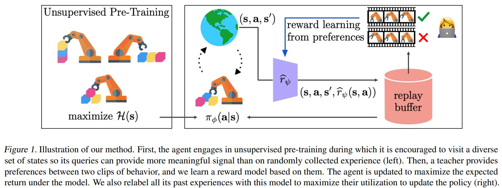
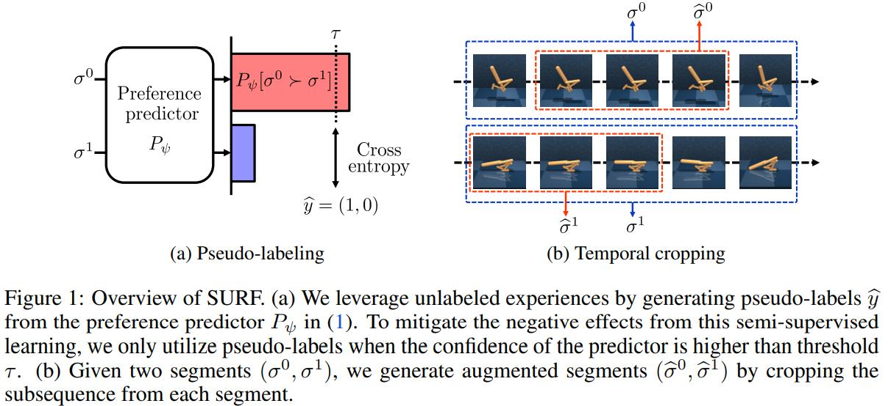
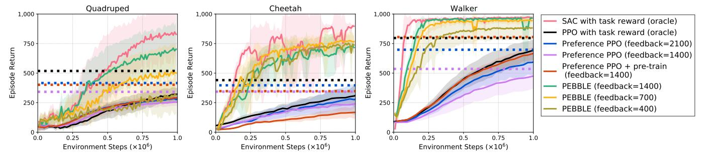
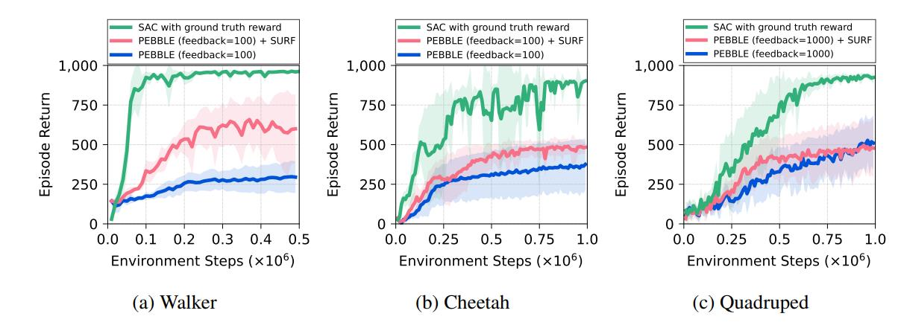

> This block is a brief introduction of your project. You can put your abstract here or any headers you want the readers to know.

<!--more-->
{: class="table-of-content"}
* TOC
{:toc}

## Main Content
Your article starts here. You can refer to the [source code](https://github.com/lilianweng/lil-log/tree/master/_posts) of [lil's blogs](https://lilianweng.github.io/lil-log/) for article structure ideas or Markdown syntax. We've provided a [sample post](https://ucladeepvision.github.io/CS188-Projects-2022Winter/2017/06/21/an-overview-of-deep-learning.html) from Lilian Weng and you can find the source code [here](https://raw.githubusercontent.com/UCLAdeepvision/CS188-Projects-2022Winter/main/_posts/2017-06-21-an-overview-of-deep-learning.md)

### Unsupervised/semi-supervised learning and data augmentation based  methods:
Although human can give effective preference feedback to RL agent to learn a good policy, such approach is only feasible when the feedback is both pratical for a human to provide and sufficiently high-bandwidth. However at the beginning of RL training, the RL agent's behavior is very random and doesn't show meaningful and understandable semantic information to human evaluators and thus the feedback is less useful. Moreover, the expensiveness and slow-speed of human evaluation prevents the agent to get enough amount of feedback information to update its reward and policy.  
 
To solve these problems, researchers use unsupervised/semi-supervised learning methods to generate more training data without increasing human preference labeling effort.  
 
In Pebble algorithm, the RL agent, at its early training stage, doesn't ask for feedback from humans, instead, it optimzies policy using the intrinsic reward (that is to explore more diverse states and actions and reduce uncertainty). After Collecting enough breadth of state-action sequences, it provides clip pairs to human evaluators, and now human can give more reasonable feedbacks. Pebble then uses human's preference-based feedback to optimize its reward function, which is a neural network in this case. Contrast to previous method that uses updated reward function to calculate the agent's current behavior and optimize the policy, Pebble has a replay buffer storing all previous state-action sequences and it uses updated reward function to relabel all these sequences as training data. The relabeling technique greatly increases avaiable training data amount and enables the agent policy to reflect the time-varying reward function more quickly.  

  

Surf algorithm is orthogonal to Pebble, and it can be directly applied to Pebble to further reduce human effort without performance loss. Surf uses semi-supervised learning to utilize a large amount of unlabeled samples with data augmentation. Same to Pebble, it uses a clip's accumulated reward calculated with current reward function as the predicted preference towards the clip, and use human evaluator's preference feedback as real label to compute the prediction loss and optimize the reward function. What Surf further does is to predict preference for more sample clip pairs, and choose these with high confidence (preference of one option is above a threshold and close to 1) as pseudo-labeled data, using them together with labeled data provided by human to compute loss and refine the reward function. Another improvement of Surf is temporal cropping for clip pairs. Temporal cropping means randomly select two continuous sub-clip of the same length respectively from the clip pair, and assign them the same preference of the complete clip pair before the cropping. Cropped clip pairs are also used to compute preference prediction loss and refine the reward function.  

  

Images below show the evaluation of pebble and surf algorithm on three different locomotion tasks. Pebble, compared to other preference-based algorithms, approaches the reward with gold reward function with the fasted speed and requires much less human feedback. When feedback amount is insufficient, surf when used together with pebble can further improve the return compared to bare pebble using the same amount of feedback.



## Basic Syntax
### Image
Please create a folder with the name of your team id under /assets/images/, put all your images into the folder and reference the images in your main content.

You can add an image to your survey like this:

{: style="width: 400px; max-width: 100%;"}
*Fig 1. YOLO: An object detection method in computer vision* [1].

Please cite the image if it is taken from other people's work.


### Table
Here is an example for creating tables, including alignment syntax.

|             | column 1    |  column 2     |
| :---        |    :----:   |          ---: |
| row1        | Text        | Text          |
| row2        | Text        | Text          |


### Code Block
```
# This is a sample code block
import torch
print (torch.__version__)
```


### Formula
Please use latex to generate formulas, such as:

$$
\tilde{\mathbf{z}}^{(t)}_i = \frac{\alpha \tilde{\mathbf{z}}^{(t-1)}_i + (1-\alpha) \mathbf{z}_i}{1-\alpha^t}
$$

or you can write in-text formula $$y = wx + b$$.

### More Markdown Syntax
You can find more Markdown syntax at [this page](https://www.markdownguide.org/basic-syntax/).

## Reference
Please make sure to cite properly in your work, for example:

[1] Redmon, Joseph, et al. "You only look once: Unified, real-time object detection." *Proceedings of the IEEE conference on computer vision and pattern recognition*. 2016.

---
